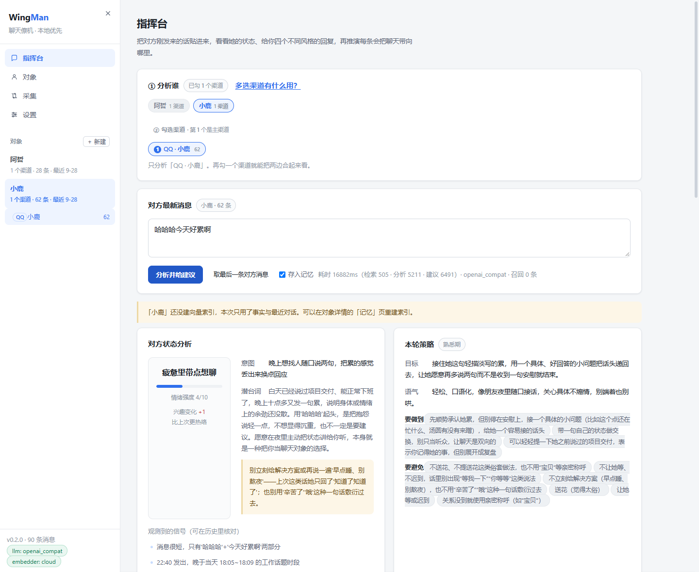
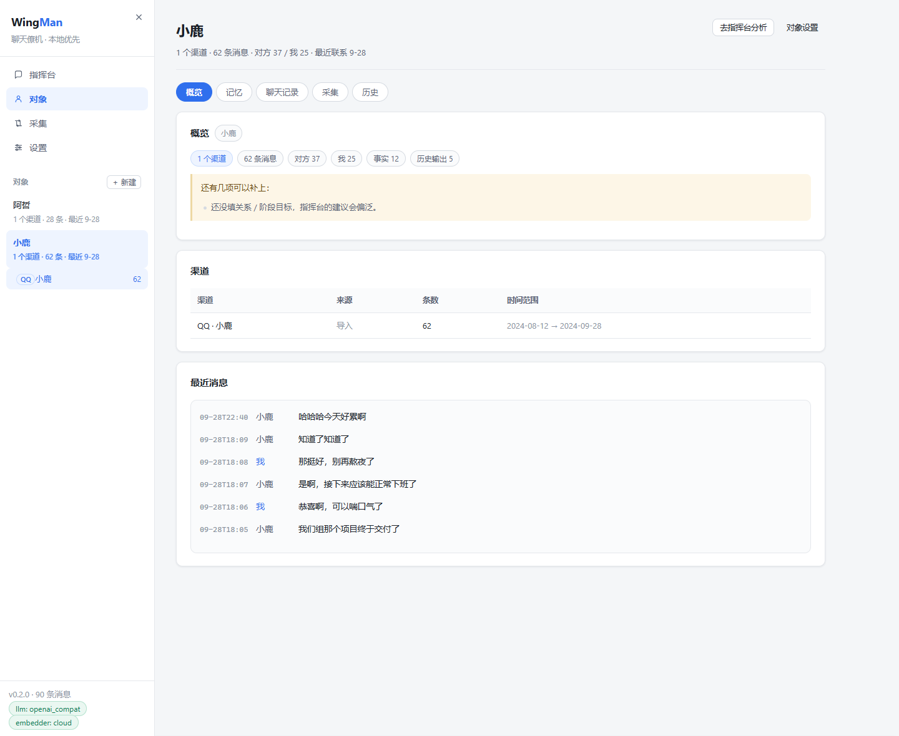
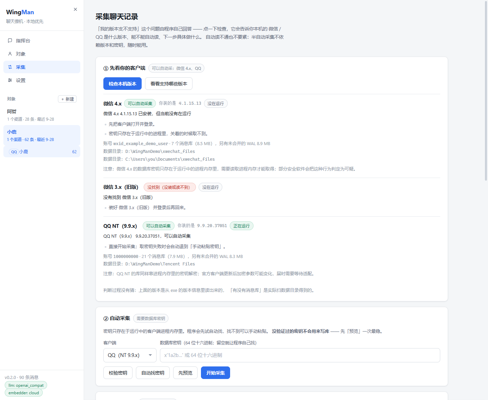

# WingMan · 聊天僚机

[](LICENSE)
[](https://www.python.org/)
[](https://github.com/whyao56/WingMan/actions/workflows/ci.yml)

> 把聊天记录交给大模型记忆，读懂 Ta 是个什么样的人，然后告诉你**该怎么回**。

WingMan 是一个本地优先的「对话参谋」系统。它做两件事：

1. **记忆** —— 导入你与某个人的聊天记录（QQ / 微信 / 通用文件），构建长期记忆与人物画像；
2. **参谋** —— 收到新消息后，分析对方情绪与意图，给出多个可选回复，并**推演每条回复会把聊天带向哪里**。

> **它只给建议，不代你发消息。** 不做无人值守的自动回复 —— 原因见 [docs/COMPLIANCE.md](docs/COMPLIANCE.md)。
>
> **通话语音转写暂时撤下了**（原「听懂」那一环）。做得不够好，不拿半成品占位置；
> 思路完整保留在「设置 · 关于」里的说明与 [docs/ROADMAP.md](docs/ROADMAP.md)，标为「规划中」。

> **v0.1.4 起以「对象」为中心。** 一个人可能在微信、QQ、换过昵称的老号上都留下记录 ——
> 它们算同一个对象的几个**渠道**，看的是合起来的视野。界面也从 7 个页签收敛成 4 个：
> **指挥台 / 对象 / 采集 / 设置**。
>
> **v0.1.5 起可以「先填、后补」。** 对象不必等记录导进来才存在 ——
> 先建一个只有名字的「小鹿」，把已知的情况随手写进去，回头再导记录；
> 导完按一下「让 AI 帮我整理」，模型**在你的草稿上补**，默认不动你手写的内容
> （回执里会逐项写明哪几项被保留了）。同时也补上了「其他聊天」这一类渠道，
> Telegram / 钉钉 / 短信里说的话不再无处安放。
>
> **v0.2.0 修掉了「点右上角 × 会卡死」**（那一版之前每次点都会中），
> 并把内存里最大的一笔浪费找了出来：`import numpy` 一下会按 CPU 核数开一堆
> 用不上的线程并预留缓冲，提交内存因此多出 700 多 MB。现在程序本体的提交内存
> 从约 845 MB 降到约 107 MB。细节见 [CHANGELOG](CHANGELOG.md)。

---

## 直接下载（不想装 Python 就走这条）

**[→ 前往下载页](https://github.com/whyao56/WingMan/releases/latest)** · 绿色免安装，解压后双击即可

| 下载 | 大小 | 说明 |
|---|---|---|
| **[`WingMan-0.2.0-win64.zip`](https://github.com/whyao56/WingMan/releases/download/v0.2.0/WingMan-0.2.0-win64.zip)** | 34 MB | 唯一的包。聊天记录分析、人物画像、回复建议、采集都在里面 |

早期版本曾分成「标准版 / 完整版」两个包，区别只在**是否内置本地语音识别**；
语音撤下后这个区别消失，两个包合并成一个。**更早的包已从下载页移除**（原因见
[「版本与状态」](#版本与状态)）—— 下载页只留当前这一版，不用再纠结选哪个。

> ⚠️ **解压后双击 `WingMan.exe`，不要只把 exe 单独拖出来。** 旁边的 `_internal`
> 文件夹是程序本体的一部分，少一个文件都起不来。要挪位置就整个文件夹一起挪。
>
> 双击没反应时，命令行跑 `WingMan.exe --check`，它会直接告诉你缺什么。
> 数据存在 `%LOCALAPPDATA%\WingMan\`，**换位置解压程序数据不会丢**。

想改代码、或者用 macOS / Linux，走下面的**源码路线**。

---

## 快速开始（3 步）

需要 Windows 10/11 与 **Python 3.11+**（安装时勾选 *Add python.exe to PATH*）。不需要 Node，不需要 API Key。

```bat
REM 第 1 步：下载并解压（也可以 git clone）
REM        https://github.com/whyao56/WingMan/archive/refs/heads/main.zip

REM 第 2 步：在仓库根目录启动（或直接双击 wingman.cmd）
wingman.cmd

REM 第 3 步：浏览器打开控制台后 →「采集」页最下面的导入区上传 samples\qq_sample_小鹿.txt
REM        →「指挥台」点「取会话里最后一条对方消息」→「分析并给建议」
```

PowerShell 里第 2 步要写成 `.\wingman.cmd`（否则提示找不到命令）。
首次运行会自动创建 Python 环境、安装依赖（几分钟，看网速），然后启动服务并自动打开 <http://127.0.0.1:8787>。

**不配模型也能跑通全流程** —— 未配置时会用内置的 Mock（规则引擎）。
但请注意：**Mock 的输出只是「流程演示」，不是真实智能**。接入真实模型见 **[docs/MODELS.md](docs/MODELS.md)**。

不想一步步来？详细步骤见 **[docs/QUICKSTART.md](docs/QUICKSTART.md)**；卡住了见 **[docs/TROUBLESHOOTING.md](docs/TROUBLESHOOTING.md)**。

> 上面这条是**源码路线**。如果你不想在这台机器上装 Python，往下看
> [「三种跑法：怎么选」](#三种跑法怎么选) —— 打包好的 `WingMan.exe` 连 Python 都不用装。

### 启动器参数

| 命令 | 作用 |
|---|---|
| `wingman.cmd` | 准备环境（首次）+ 启动 + 打开浏览器 |
| `wingman.cmd --port 8899` | 换端口（默认 8787） |
| `wingman.cmd --no-browser` | 不自动打开浏览器 |
| `wingman.cmd --setup-only` | 只准备环境，不启动服务 |
| `wingman.cmd --doctor` | 只做启动前自检，逐项打印结果与修复建议 |
| `wingman.cmd --help` | 用法 |

---

## 三种跑法：怎么选

有三种跑法。**分水岭只有一个：这台机器愿不愿意装 Python。**

| | A. 一键启动器 | B. 打包版 | C. 手动源码 |
|---|---|---|---|
| 入口 | `wingman.cmd` | `WingMan.exe` | `uvicorn` |
| 需要 Python | ✅ 3.11+ | ❌ 不用装 | ✅ 3.11+ |
| 首次启动 | 几分钟（自动建环境装依赖） | 秒级 | 几分钟 |
| 体积 | 仓库本身（几 MB） | 下载 34 MB | 仓库本身 |
| 改了代码 | 直接生效 | 要重新打包 | 直接生效 |
| 适合 | 想改代码 / 已装 Python | 只想用，或给不懂技术的朋友 | 非 Windows、要做开发 |

### A. 一键启动（Windows，推荐）

```bat
wingman.cmd
```

首次运行会自动：创建 Python 环境 → 按锁定版本装依赖 → 启动前自检 → 起服务 → 打开浏览器
（`http://127.0.0.1:8787`）。

详细步骤见 **[docs/QUICKSTART.md](docs/QUICKSTART.md)**，参数速查：

| 命令 | 作用 |
|---|---|
| `wingman.cmd` | 准备环境（首次）+ 启动 + 自动开浏览器 |
| `wingman.cmd --doctor` | 只做启动前自检，逐项打印结果与修复建议 |
| `wingman.cmd --setup-only` | 只准备环境，不启动 |
| `wingman.cmd --port 8899` | 换端口 |

> PowerShell 里要写 `.\wingman.cmd`。用 PowerShell 工具的会话请照此处理。

### B. 打包版（连 Python 都不用装）

从 **[下载页](https://github.com/whyao56/WingMan/releases/latest)** 拿到 zip（内容见上文
[「直接下载」](#直接下载不想装-python-就走这条)），解压到一个**可写**的位置（桌面、D 盘都行），
双击 `WingMan.exe`。程序会自己起服务并弹出原生窗口，关掉窗口即退出。

| 体积 | 解压后 | 里面有什么 |
|---|---|---|
| 34 MB | 约 77 MB | 全部功能：聊天记录分析、人物画像、回复建议与推演 |

> 早期的「完整版」（91 MB / 解压后 237 MB）多一套本地语音识别，语音撤下后并入单包。
> 那些历史包在 0.2.0 归档时已从下载页移除 —— 功能被当前版本完全覆盖，
> 留着只会让人在下载页上做一次没有意义的选择。

**你的数据在** `%LOCALAPPDATA%\WingMan\` —— 聊天记录、画像、设置、日志都在那。

第一次打开会提示「还有 N 项没配好」，这是正常的：默认用的是演示引擎、还没导入聊天记录。
照着**「设置」页最下面的体检**逐条点，每配好一项就会变绿 —— 侧栏底部也会常驻一条提醒。

怎么自己打个包，见 **[docs/DESKTOP.md](docs/DESKTOP.md)**。

### C. 手动从源码跑（任意平台）

```bash
cd wingman/backend
python -m venv .venv
.venv/Scripts/activate          # Windows
# source .venv/bin/activate     # macOS / Linux
pip install -r requirements.txt   # 或 requirements.lock.txt（精确版本）

python -m uvicorn app.main:app --reload --port 8787
# 打开 http://127.0.0.1:8787
```

**不需要任何 API Key 也能跑通全流程** —— 未配置模型时会自动使用内置的 Mock Provider，
走完「导入 → 画像 → 分析 → 建议 → 推演」整条链路，方便你先看懂它怎么工作。
想让建议真的有意义，去接真模型 —— 见 **[docs/MODELS.md](docs/MODELS.md)**。

想接真模型时，在控制台「设置」里填 `base_url` / `api_key` / `model` 即可，
支持一切 **OpenAI 兼容协议**的云端服务（DeepSeek、通义、Kimi、硅基流动、OpenAI…），
也支持 **Ollama** 本地模型（数据不出本机）。

---

## 排错从哪下手

**两条路的自检入口不一样，先找对那个：**

| 你用的是 | 命令 | 产物 |
|---|---|---|
| `wingman.cmd` | `wingman.cmd --doctor` | 终端逐项输出（退出码 2 = 拒绝启动） |
| `WingMan.exe` | `WingMan.exe --check` | `%LOCALAPPDATA%\WingMan\logs\selfcheck.txt` |
| 界面里 | 「设置」页最下面的**体检**（侧栏底部会常驻提醒，点一下直达） | 三档结论 + 每项一个「点哪里能修好」按钮 |

再往下看 **[docs/TROUBLESHOOTING.md](docs/TROUBLESHOOTING.md)**（排错手册）和
[docs/DESKTOP.md](docs/DESKTOP.md)（打包特有的坑）。

---

## 版本与状态

- **当前版本：v0.2.0**（版本号定义在 `backend/app/__init__.py`，变更记录见 [CHANGELOG.md](CHANGELOG.md)）
- **状态：有成品包可用了。** [Releases](https://github.com/whyao56/WingMan/releases) 提供免安装的
  Windows 桌面版（双击即用，不需要 Python）；源码路线同样可用。
  **最大的缺口是建议内容本身** —— 默认的 Mock 引擎让整条链路跑得通，但给的建议还是规则生成的，
  下一步是 Prompt 调优，详见 [docs/ROADMAP.md](docs/ROADMAP.md)。
- **下载页只有 v0.2.0 带安装包。** 更早的版本（v0.1.0 ~ v0.1.5）在归档时收成了**纯文本**：
  每个版本留一份说明，讲清它做了什么、修了什么（过程记录收在 [docs/DEVLOG.md](docs/DEVLOG.md)），
  但**不再提供二进制** —— 它们的功能已被 v0.2.0 完整覆盖，继续挂着只会让人下一个过时的包。
  想看旧实现，`git log` 里都在。

| | 说明 |
|---|---|
| ✅ 现在就能用 | 导入（QQ / 微信 / 通用 JSON、CSV）→ 向量索引 → 事实与画像 → 分析 → 建议 → 推演 的完整链路；**以「对象」为中心**（一人多渠道，可合并看）；聊天记录可二次编辑；输出有历史留存；零 Key 用 Mock 跑通；OpenAI 兼容云服务与 Ollama 可切换；单文件控制台 |
| 🟡 采集（半自动实测可用） | 采集页四步：判断本机版本 → 自动采集（六道关全通，但**实测这两个版本取不到密钥**）→ **半自动采集（读剪贴板，不依赖版本与密钥）** → 游标。详见 [采集聊天记录](#采集聊天记录两条路一条能自动一条点哪条抓哪条) |
| ⏸️ 已撤下（规划中） | **通话实时转写**。上一版试过云端转写，但延迟、双方串音、断句切碎都还不够好，而且要把通话音频送出本机 —— 对一个「本地优先」的工具来说代价不划算。已从界面与代码里整体移除（0.1.4 起收进「设置 · 关于」的折叠说明），思路保留在 [docs/ROADMAP.md](docs/ROADMAP.md) |
| ⬜ 尚未实现 | 事实人工校对 UI、前端工程化、自动回复（明确不做，见 COMPLIANCE）、自动采集的密钥获取（等客户端版本变化后再适配） |
| 验证过的环境 | 中文 Windows + Python 3.11（实测安装 + 端到端人工验收）；Python 3.13 已由 CI 在真实环境验证：GitHub Actions（Ubuntu）用同一份锁定集真实安装并跑通冒烟测试（`3.11` / `3.13` 两个 job 均 success，见 [Actions](https://github.com/whyao56/WingMan/actions/workflows/ci.yml)），但**开发机没有 3.13、未在本机真跑**；macOS / Linux 桌面未做人工验收 |

---

## 它长什么样

界面是这样的（浅色、不刺眼；顶部那三张「上手卡」在配置完成后会自动消失）：



选中和某个人的全部聊天记录 → 告诉它你的目标（比如"想约她周末看展"）→
之后对方每发一条消息，你点一下「分析」，它就给你：

```
┌─ 对方状态分析 ────────────────────────────────┐
│ 情绪：疲惫里带点想聊   强度 4/10   兴趣变化 +1   │
│ 意图：晚上想找人随口说两句，把累的感觉丢出来换点回应 │
│ 潜台词：白天说过项目交付，十点多又发一句累 ——      │
│         余劲没散。用"哈哈哈"起头是把抱怨说轻一点   │
│ 信号：① 只有 7 个字 ② 22:40 发来 ③ 没有提问      │
│ 风险：别立刻给解决方案，"早点睡"上回她只回了三个字  │
└───────────────────────────────────────────────┘

┌─ 建议回复（4 选 1）─────────── 综合分 ── 走向预测 ─┐
│ D 顺势推进 "周末缓过来就火锅走一个，毛肚管够" 6.6 升温 66%│
│ A 接梗调侃 "笑这么大声，是累到没力气抱怨了吧" 5.7 持平 61%│
│ B 真诚共情 "熬了这么久，累是攒着的吧"         5.7 持平 61%│
│ C 好奇引导 "这个点还没歇？汤圆有没有来趴你键盘上" 5.7 持平 61%│
└───────────────────────────────────────────────┘
        ↓ 点任意一条，展开 3 轮走向推演树
```

每条建议都带**自然度 / 共情 / 推进力 / 风险**四个维度的打分依据，
以及"为什么这么回 / 预期效果 / 风险"。分数是本地启发式算的，用来排序，不是绝对值。

**以「对象」为中心**（v0.1.4 起）—— 一个人可以有多段记录，看的是合起来的视野：



---

## 采集聊天记录：两条路，一条能自动，一条点哪条抓哪条

导入解决的是「我手里有一个导出的 txt」。但你平时根本不会去导出 ——
记录躺在客户端本地库里，想用的时候才想起来手上什么都没有。所以有了「采集」页。

这一页有两个通道，界面上是并列的两个卡片，不是一个主一个「高级选项」：

| | 自动采集 | 半自动采集 |
|---|---|---|
| 你需要做什么 | 点一下 | 在客户端里选中消息，`Ctrl+C` |
| 依赖 | 数据库密钥 + 客户端版本对上 | **什么都不依赖** |
| 拿到什么 | 该会话的历史消息（含时间、说话人） | 你复制的那几条（含时间、说话人） |
| 现状 | 代码全通，但**本机这两个版本取不到密钥**（下面有实测） | 实测可用 |

半自动采集的实现就是「读剪贴板」：你在客户端里选中消息复制，
程序按 `GetClipboardSequenceNumber()` 判断内容真的变了，再把这一坨文本解析成
`(说话人, 时间, 正文)`。听上去土，但它是唯一不依赖版本和密钥的通道 ——
**内容你已经看见了，它不需要去猜。**

### 「我的版本支不支持」由程序回答，不由文档回答

这一点是刻意的：**版本指引写进软件，不写进 README**。

理由很直接 —— 文档不会知道用户装的是哪个版本。把支持范围写成一张表放在 README 里，
用户读到的是一句正确但没用的话；他真正需要的是「我这台机器上，
这个 9.9.20.37051 能不能用、下一步点什么」。所以：

- 支持矩阵是 `backend/app/collect/matrix.py` 里的**数据**（含「我实测过的版本」）；
- 探测结果和矩阵在采集页第 ① 张卡片里合起来给结论，附带**照做的事**（不是错误码）；
- 结论分四档：`可以自动采集` / `在支持范围内但没实测过这个具体版本` /
  `不在已验证范围内` / `没找到（没装或读不到）`，每一档都带下一步动作。

界面上直接读 exe 的版本信息，不用用户自己去「关于」里抄版本号。

### 本机实测：自动取密钥这条路的结论

实测环境：**QQ NT 9.9.20.37051**（`D:\Program Files\Tencent\QQNT`）、
**微信 4.1.13.12**（进程名 `Weixin.exe`）。

自动取密钥在**这两个具体版本上走不通**，而且是有依据的走不通：

| 手段 | 实测结果 |
|---|---|
| `x'<64位hex>'` / 引号包裹的十六进制串 | QQ 内存里找到 30 处、去重 8 个候选，**全部校验失败**；微信 **0 处** |
| 裸的 64 位十六进制串（附近有 sqlite 字样） | 无有效候选 |
| 32 字节二进制滑窗穷举 | 单候选约 4 µs（首块优化后约 1 µs），按可读内存推算单线程上千小时，不可行 |
| 按 salt 命中点收缩范围再穷举 | 88 MB 范围内 8,784 万候选 × 2 套参数各跑 419 秒（约 21 万/秒），**未命中** |

所以这里没有「假装能成」：取不到就明说取不到，并把半自动采集摆在**并列的位置**
而不是「失败后的安慰」。手动粘贴密钥是一等公民 —— 你从任何渠道拿到密钥，
后面的定位库、剥头、解密、认列、增量入库全都是真跑的。

### 自动采集的六道关，每道都可能合理地失败

```
① 探测    装了吗 / 开着吗 / 版本在支持范围内吗 / 数据目录在哪
② 取密钥  缓存 → 用户粘贴 → 自动搜内存（有预算、有结论，不假装能成）
③ 解密    剥自定义头、逐页解密、套用 WAL（不套会漏掉最近的消息）
④ 认列    这个库里哪一列是时间、哪一列是正文、哪一列是说话人
⑤ 读消息  按游标取增量，判「这是我说的还是对方说的」
⑥ 入库    会话归属到人、消息去重写入、记下游标
```

两条设计原则贯穿全程：

- **每一道失败都返回「为什么 + 下一步做什么」**，不是抛异常也不是返回空。
  这条链上最贵的不是慢，是**看起来成功了** —— 用户以为采到了，其实一条都没有。
- **认列按数据认，不写死列号。** QQ 的列名是数字（`40011` / `40033`），
  微信是英文名但库会随版本分片重建。写死列号等于赌用户装的就是我见过的版本，
  赌错的表现是「读写都不报错，但时间列取到了消息 ID」。认不出来就如实报候选列。

### 采集页长什么样



> 图里的账号与路径是示例值（截图前替换过），不是任何人的真实信息。

四张卡片就是四个问题：① 我的版本支不支持 ② 自动采集能不能跑 ③ 采不动怎么办
④ 采到哪了（游标）。第 ② 张卡片的「先预览」走完整条链路但**不写库** ——
采集是不可逆地把东西塞进记忆，所以必须有一个「先看看」的入口。

### 半自动采集的两条底线

**归属认不出就停下来问，不猜。** 复制出来的块头能对上已知的名字
（`小鹿 2026-09-28 21:03:15` / `小鹿: 正文`）就直接入库；对不上就挂起，
界面上问你一句。这不是保守 —— 「把老王的话记成小鹿说的」是**静默错误**，
之后所有画像、检索、建议都建立在错的人身上，而你不会发现。

**时间不能假装。** 剪贴板经常不带时间。**v0.1.4 起不再用「抓取时刻」顶替**，
而是按该会话的时间线**推定**（锚点 = 库里最后一条消息，逐秒递增，且绝不越过复制时刻），
标成 `inferred`，界面上显示「时间推定」。复制一段上周的记录、记成今天 ——
这种事不会再发生了。真时间轴上混进假时间，「她平时几点找我说话」这类结论就是错的。
想更严格就把策略设成「停下来问我」，没时间就不落库。

### 数据落在哪

采集进来的消息和导入的完全同构，都进 `messages` 表，只是多两个标记：

| 字段 | 值 | 含义 |
|---|---|---|
| `chats.source` | `import` / `collect` | 这条记录是导入的还是采集的 |
| `messages.ts_source` | `clipboard` / `relative` / `inferred` / `assumed` / `manual` | 时间是从哪来的（见下） |

`ts_source` 的五种取值，界面上每条消息都会标出来，采集页可以点开看解释：

| 值 | 含义 |
|---|---|
| `clipboard` | 复制的文本自己带了年月日 —— 最可信 |
| `relative` | 文本里是「昨天 21:03」这类相对时间，按复制那一刻往前推 |
| `inferred` | 完全没带时间，按该会话的时间线推定（**默认**） |
| `assumed` | 旧的「抓取时刻」，**只用于兼容老数据**，不再产生新条目 |
| `manual` | 你自己填的 |

另外还有一列 `messages.captured_at` 记**采集时刻**，与消息自身的 `ts` 分开存 ——
「什么时候采的」和「消息是什么时候发的」是两件事。

会话归属走 `person_id`：采「小鹿」时会先按名字/别名**精确**找人，
找到就复用（同渠道的会话也复用同一个 `chat_id`），找不到才新建。
不这么做的话，采集采一次就多一个「小鹿」，而这两个小鹿的消息永远检索不到一起。
合并永远由你显式发起 —— 自动猜「QQ 上的张三和微信上的张三是同一个人」没有可靠依据。

---

## 通话转写：暂停了，但思路留着

「通话时实时听懂对方」是这个项目最早的想法之一，上一版也真的做出来了 ——
双通道采集 + 云端/本地转写 + 实时字幕，跑得通。但效果不够好：

- 转写有可见延迟，对话里等不起；
- 双方声音串音，人和话对不上；
- VAD 按静音切句，一句「我觉得……（停顿）……还是算了吧」被切成两段，语义就断了；
- 而要对齐这些，最省事的办法是把通话音频送到云端 —— 对一个「本地优先」的工具，
  这个代价不划算。

所以这一块**从界面到代码整体撤下来了**，没有留半成品占位置。留下的是想清楚的方案：

| # | 思路 | 为什么 |
|---|---|---|
| 1 | **双通道采集，把「谁说的」分清** | 一路抓系统回环当「对方」，一路抓麦克风当「我」，两条流独立分帧、独立识别。事后靠声纹去切是下策 —— 切错一次整段记录都不可信 |
| 2 | **本机转写，音频不出机器** | 用 `faster-whisper` 本地跑，模型权重存数据目录、可离线。代价是首次要下模型、CPU 比显卡慢，但换来的是一帧音频都不上传 —— 这正是这个工具存在的理由 |
| 3 | **按「话轮」断句，而不是按静音断** | VAD 先粗切，再用小模型判断句尾是否完整，不完整就继续等下一帧。宁可多等几百毫秒，也不切坏一句话 |
| 4 | **落库时和文字记录同构** | 转写结果按 `(时间, 说话人, 文本)` 写成普通消息，只多带一个 `source=call` 标记。这样记忆、向量检索、人物分析都不用为通话写第二套逻辑 |
| 5 | **开录前把话说在前面** | 录音涉及法律问题。开始前明确确认，只用于你本人参与的通话、只存本机，且不提供「采集他人对话」的用法。这条不做成可关闭的选项 |

界面上的入口在**「设置」页最下面的「关于」→ 通话（规划中）**，展开是一份折叠说明 ——
点进去看不到按钮，因为后端入口也已经一并移除了，不会出现「点了没反应」。
（0.1.4 之前它是一个独立页签，占着一级导航的位置却什么都不能做。）

> 为什么连代码一起删，而不是留个开关？因为这个项目的每个可选项最后都要有人维护、
> 要有人测、要在发版清单里占一行。一个「暂时没有出口」的功能留在仓库里，
> 只会让下一个来读代码的人以为它可用。想回来看实现，`git log` 里有。

---

## 架构总览

```
                    ┌──────────────────────────────────────────┐
   聊天记录文件  ──▶ │  Adapter 层（插件式）                     │
   QQ / 微信 / JSON  │  qq.py · wechat.py · generic.py          │
                    └────────────────┬─────────────────────────┘
                                     │
   客户端本地库   ──▶ ┌───────────────▼──────────────────────────┐
   QQ NT / 微信 4.x  │  Collect 层                               │
   剪贴板（半自动）  │  detect · matrix · keys · sqlcipher       │
                    │  reader（认列）· pipeline · semi（剪贴板） │
                    └────────────────┬─────────────────────────┘
                                     │  归一成同一套 Msg
                                     ▼
                    ┌──────────────────────────────────────────┐
                    │  Memory 层                                │
                    │  SQLite 存储 · Embedder · 混合检索 · 画像  │
                    └────────────────┬─────────────────────────┘
                                     ▼
                    ┌──────────────────────────────────────────┐
                    │  Engine 层（核心）                        │
                    │  Analyzer → Suggestor → Simulator        │
                    └────────────────┬─────────────────────────┘
                                     ▼
                    ┌──────────────────────────────────────────┐
                    │  LLM 层（可切换）                          │
                    │  OpenAI 兼容 · Ollama · Mock             │
                    └──────────────────────────────────────────┘

   （通话音频 ──▶ 转写 ──▶ Engine 这条支线已撤下，见上一节）
```

采集层的两条路都汇进同一个 `messages` 表 —— 记忆、检索、画像都不用为
「这条是从哪来的」写第二套逻辑，只在 `chats.source` / `messages.ts_source`
两个字段上留痕。

详细的模块划分、数据流、接口契约见 **[docs/ARCHITECTURE.md](docs/ARCHITECTURE.md)**。

---

## 文档

| 文档 | 内容 |
|---|---|
| [docs/QUICKSTART.md](docs/QUICKSTART.md) | 3 步上手：下载 → 启动 → 看到第一条建议 |
| [docs/DESKTOP.md](docs/DESKTOP.md) | **打包成桌面程序**：怎么用、怎么构建、踩过的坑 |
| [docs/MODELS.md](docs/MODELS.md) | 接真实模型：OpenAI 兼容云 API / Ollama、怎么确认接上了、密钥与隐私边界 |
| [docs/TROUBLESHOOTING.md](docs/TROUBLESHOOTING.md) | 排错手册：退出码含义、端口占用、Python 版本、依赖装不上、中文乱码、代理劫持回环请求…… |
| [docs/ARCHITECTURE.md](docs/ARCHITECTURE.md) | 系统架构、模块职责、数据模型、接口契约 |
| [docs/ENGINE_DESIGN.md](docs/ENGINE_DESIGN.md) | 参谋引擎的算法与 Prompt 设计（这是项目的灵魂） |
| [docs/ROADMAP.md](docs/ROADMAP.md) | 迭代路线：从脚手架到能用、好用 |
| [docs/DEVLOG.md](docs/DEVLOG.md) | **开发全流程**：每个版本从哪来、怎么做、踩到什么、怎么验证 |
| [docs/COMPLIANCE.md](docs/COMPLIANCE.md) | 数据合规、隐私边界、使用红线 |
| [CHANGELOG.md](CHANGELOG.md) | 版本变更记录 |

---

## 目录结构

```
WingMan/
├── wingman.cmd                  # 一键启动器（源码路线入口）：装环境 / 自检 / 启动
├── backend/
│   ├── app/
│   │   ├── adapters/            # 聊天记录接入插件（QQ / 微信 / 通用）
│   │   ├── collect/             # 采集层：探测 / 版本矩阵 / 取密钥 / 解密 / 认列 / 剪贴板
│   │   ├── memory/              # 存储、向量化、检索、人物画像
│   │   ├── llm/                 # 大模型接入（云 / 本地 / Mock）
│   │   ├── engine/              # 分析 → 建议 → 推演 核心引擎
│   │   ├── api/                 # HTTP 接口
│   │   ├── desktop.py           # 桌面启动器（exe 入口，含 --check）
│   │   └── selfcheck.py         # 应用内自检：缺什么、怎么补
│   ├── run_wingman.py           # PyInstaller 打包入口
│   ├── tests/                   # 冒烟测试 + 回环代理 / 版本号一致性 / 前端资源守卫
│   │                            # + 采集层六个守卫：cipher / clipboard / reader / semi / api
│   │                            #   / offwindows（非 Windows 上必须能 import）
│   │                            # + 对象中心：多渠道上下文、桌面壳关窗、检查更新
│   │                            # + 隐私守卫：不许出现真人姓名，提交邮箱必须匿名
│   ├── requirements.txt         # 依赖下限声明（人类可读）
│   ├── requirements.lock.txt    # 精确版本锁定（启动器安装的就是它）
│   ├── requirements-desktop.txt # 打包工具链（pyinstaller / pywebview）
│   └── data/                    # 运行时数据（已 gitignore）
├── frontend/index.html          # 单文件控制台，零构建
├── build/wingman.spec           # PyInstaller 打包配置
├── samples/                     # 虚构的示例聊天记录，可直接导入试跑
├── scripts/
│   ├── bootstrap.ps1            # 启动器主体（建环境 / 装依赖 / 调 preflight）
│   ├── preflight.py             # 启动前自检（wingman.cmd --doctor）
│   ├── build_exe.py             # 一键打包成 exe
│   ├── e2e_check.py             # HTTP 端到端检查
│   ├── openai_stub.py           # 本地假 OpenAI 服务（离线联调用）
│   └── run_dev.*                # 开发态启动脚本
└── docs/
```

### 开发者：手动跑测试

```bat
REM 准备环境（不启动服务；环境建在 backend\.venv）
wingman.cmd --setup-only

REM 内核链路冒烟测试（Mock，无需任何 Key）
backend\.venv\Scripts\python.exe backend\tests\test_smoke.py

REM 端到端 HTTP 检查（需要服务已经在运行）
backend\.venv\Scripts\python.exe scripts\e2e_check.py
```

采集层的守卫测试可以单独跑，每一个都能脱离 pytest 直跑：

```bat
REM 解密器：自己造一个 SQLCipher 库再解回来（真库密钥拿不到时的唯一验证方式）
backend\.venv\Scripts\python.exe backend\tests\test_collect_cipher.py
REM 剪贴板解析：块头、时间位置、认不出说话人时必须拒绝
backend\.venv\Scripts\python.exe backend\tests\test_collect_clipboard.py
REM 读库认列：用合成库做往返
backend\.venv\Scripts\python.exe backend\tests\test_collect_reader.py
REM 半自动采集：有依据就落库 / 没依据就挂起 / 防重 / 复用已有的人
backend\.venv\Scripts\python.exe backend\tests\test_collect_semi.py
REM 采集接口契约（含一项真的写系统剪贴板的端到端，默认跳过）
set WINGMAN_E2E_CLIPBOARD=1
backend\.venv\Scripts\python.exe backend\tests\test_collect_api.py
REM 非 Windows 上必须也能 import（模拟 Linux，防「本地全绿、CI 全红」）
backend\.venv\Scripts\python.exe backend\tests\test_collect_offwindows.py
REM 隐私守卫：不许出现真人姓名（统一用虚构的「小鹿」）；提交元数据不许带真实邮箱
backend\.venv\Scripts\python.exe backend\tests\test_privacy_pseudonyms.py
```

> `WINGMAN_E2E_CLIPBOARD=1` 那一项会**临时改写系统剪贴板**（结束后把原内容还回去）。
> 默认跳过，因为测试不该有副作用。

> `e2e_check.py` 会**往当前数据库里写数据**（导入示例会话、写入设定）。
> 想保持数据干净，就另解压一份仓库、或者先把 `backend\data\wingman.db` 备份出来再跑。

---

## 常见问题

> 这几条是最常遇到的；完整的排错手册在 **[docs/TROUBLESHOOTING.md](docs/TROUBLESHOOTING.md)**。

**端口 8787 被占用**
换端口启动：`wingman.cmd --port 8899`。查是谁占着：`netstat -ano | findstr :8787`。

**跑 `scripts/e2e_check.py` 时报 404**
环境里设了 `HTTP_PROXY` / `http_proxy` 时，httpx 默认把请求发给代理，
代理用「绝对地址」形式转发，本地 uvicorn 收到 `http%3A//127.0.0.1%3A8787/api/...`
这种畸形路径就 404 了。脚本里已经用 `trust_env=False` 绕开，
如果你自己写调用脚本，记得同样处理。

**上传中文名的文件失败（旧版本的问题，现已支持）**
早期版本在 multipart 的 filename 里处理非 ASCII 有问题；**现在已支持中文名上传** ——
按 [QUICKSTART](docs/QUICKSTART.md) 第 3 步直接传 `samples\qq_sample_小鹿.txt` 即可（端到端检查实测全绿）。
如果你的环境里仍然失败（极少见），把文件复制一份改成英文名再上传即可，内容不受影响。

**「通话」这个东西在哪？**
在**「设置」页最下面的「关于」**里，是一个折叠的说明区。它现在就是「规划中」——
语音转写这一轮撤下来重做了，页面上保留了设计思路，但没有任何按钮，后端接口也已一并移除，
所以不会出现「点了没反应」。想了解详细原因和方案，见上文[「通话转写：暂停了，但思路留着」](#通话转写暂停了但思路留着)。

**点右上角的 × 之后弹了一个框**

那是 v0.1.4 加的，三选一：**关闭程序**（服务停掉）/ **关闭弹窗（后台运行）**
（窗口收起来，服务继续在后台跑）/ 取消。选过之后会记住你的选择，不会每次都问。

> v0.2.0 修掉了这一处的卡死：在那之前**每次**点 × 都会让窗口「未响应」几秒。
> 原因是关窗回调跑在界面线程上，却在里面**同步**等一段 JavaScript 执行完 ——
> 而那段脚本要跑还是得回到界面线程，两边互等，谁也动不了。现在回调只负责发信号，
> 真正的等待挪到后台线程并带超时。详见 [CHANGELOG.md](CHANGELOG.md)。

选了「后台运行」想把窗口找回来：**再双击一次 `WingMan.exe`**。程序会发现服务已经在跑，
请原来那个进程把窗口显示出来 —— 不会另起一个。（浏览器模式下本来就没有原生窗口，
直接用浏览器打开 `http://127.0.0.1:8787/` 即可。）

> 想彻底不让服务留在后台，就用「关闭程序」，别用任务管理器直接结束进程 ——
> 那会跳过优雅退出，正在写的数据库可能被打断。

**「检查更新」说「不知道」**

不是坏了。它要连 GitHub 的接口，断网、走代理、被限流、公司网络拦截都会走到这一句。
**这是刻意的**：「没查到」和「查到了、没有新版本」是两件不同的事，
合并成一句「已是最新」就是在骗你。所以它宁可说不知道，并给你项目地址让你自己看。

**双击 exe 没反应 / 提示「Windows 已保护你的电脑」**

后者不是 bug，是 Windows 对未签名程序的默认行为：点「更多信息」→「仍要运行」。

前者请按顺序做两件事：
1. 打开 `%LOCALAPPDATA%\WingMan\logs\wingman.log`，最后一段就是出错原因
2. 命令行执行 `WingMan.exe --check`，它会生成一份人话报告并写到
   `%LOCALAPPDATA%\WingMan\logs\selfcheck.txt`，可以直接发给别人看

**Mock 模式下分析结果是废话**
这是预期的。Mock 只是一套规则，用来验证流程能不能跑通。
接上真实模型（设置页填 base_url / api_key / model）之后才会有真正的理解能力。
判断标准见 [ROADMAP](docs/ROADMAP.md) 最后一节。

---

## 踩坑记录

这些是开发中真实踩到、且值得写下来的坑。共同点是**它们都不报错** ——
只是安静地给你错误的结果，所以很难自己发现。

### 1. 把一对多关系建模成了字典

`facts` 表最初的唯一键是 `(chat_id, subject, key)`，意思是「同一个人同一个 key 只能有一个值」。
配合 `INSERT OR REPLACE`：

```sql
-- 抽到「我超爱吃火锅的」→ 写入
INSERT OR REPLACE INTO facts (chat_id, subject, key, value)
  VALUES ('c1', 'peer', '喜欢', '吃火锅');
-- 之后抽到「我超喜欢猫的」→ 把上面那行**替换掉**
INSERT OR REPLACE INTO facts (chat_id, subject, key, value)
  VALUES ('c1', 'peer', '喜欢', '猫');
```

结果：「她喜欢猫」永久消失，画像里只剩「喜欢火锅」，**全程没有任何报错**。

「喜欢」在现实里是一对多关系（猫 / 火锅 / 陶艺），不是字典键值。
唯一键必须带上 `value`：

```sql
UNIQUE (chat_id, subject, key, value)
```

改约束需要重建表（SQLite 不支持 `ALTER` 约束）。
`Store._migrate_facts_unique()` 读 `sqlite_master` 里的原始 DDL 判断版本并自动迁移，
老库数据不丢、重复执行幂等。

### 2. 「本地全绿」不等于「CI 绿」，但原因常常不是平台

这个 bug 是 CI 第一次运行抓出来的，本地一直是绿的。第一反应是「Linux 和 Windows 有差异」，
实际排查下来**与平台无关**：改完 `mock.py` 后我只跑了 HTTP 端到端脚本 `e2e_check.py`
（它不检查事实抽取），**没有重跑 `tests/test_smoke.py`**，
于是本地测试结果还停留在改坏之前的状态。

有效的定位手段是让本地条件对齐：用不同的 `PYTHONHASHSEED` 连跑三次。
三次结果完全一致，就可以排除哈希随机化，问题必然出在确定的代码路径上。

> 教训：改完被多处复用的代码，要把**所有**测试跑一遍。
> CI 最大的价值不是「更严格」，而是**它不会忘记跑**。

### 3. 单层测试通过 ≠ 集成正确

`store` 的唯一约束、`mock` 的事实压缩、`profiler` 的分批抽取，
**每一层单独看行为都是「合理」的**，叠在一起却会丢数据。
上面这个 bug 最终在三个文件里分别修：schema 约束、分组保留多条、长度过滤改白名单。

### 4. 「删掉一个功能」比「加一个功能」更容易留下垃圾

撤下通话语音时，我按 `grep asr` 干掉了 60 多处引用，跑测试 **当时那 41 项全绿**，
看起来干净了。但复查时发现还有一堆东西活着：

| 漏掉的 | 为什么测试抓不到 |
|---|---|
| `app/bus.py` | 它是「采集线程 → SSE 客户端」的进程内事件总线。SSE 端点删了，就再没人 `subscribe()`，但 `EventBus` 自己仍然被 `main.py` 实例化并 `bind_loop()` —— 语法合法、启动不报错，**只是永远收不到事件** |
| `check_optional_soundcard` / `check_optional_faster_whisper` | 仍注册在 `preflight.py` 的 `CHECKS` 里。它们在 `--doctor` 报告里继续列着「未安装 soundcard（可选）」—— 用户看到的是**一个不存在的功能提示他装依赖** |
| 三处文档字符串、`schemas.py` 的 `# llm \| embedder \| asr` 注释 | 注释和字符串常量不参与运行，改轮廓不会碰到它们 |
| `docs/TROUBLESHOOTING.md` 删掉一章后，`docs/MODELS.md` 里「见第 10 节」的交叉引用全部错位 | 是**跨文件的数字**，两边谁也管不到谁 |
| `scripts/e2e_check.py` 开头写着「依次验证：… → 语音注入 → SSE」 | 这是**说明里列的功能清单**。检查代码删了两步、说明没改，于是「文档说会验的事」和「脚本真的验的事」从此不一致 —— 下一个人照着说明排查会白跑很久 |
| `.env.example` 里 14 个 `ASR_*` / `WHISPER_*` / `VAD_*` 键 | 配置字段删干净了、测试也全绿，但**示例文件还留着**，配着「引擎：mock \| cloud \| local」的注释。照着配的人会以为功能还在，填了不报错、也不生效 |

共同点：**它们都不会报错**。测试全绿说明的是「现有断言都还成立」，
不等于「删干净了」—— 因为没人给「这个东西不该再存在」写断言。

> 教训：删除类改动的验收标准不是「测试通过」，而是**「搜不到残留引用 + 逐处确认它的调用方也没了」**。
> 具体做法是四层检查：
> ① `grep` 关键词，逐条看是不是现存功能；
> ② 对每个要删的模块问「**谁在调用它**」，调用方也删了才算删干净（`bus.py` 就是这么揪出来的）；
> ③ 跨文件引用的章节号 / 文件名，改完统一再搜一遍；
> ④ **回头读一遍「面向人的说明文字」**（README、脚本头部的 docstring、`.env.example` 的注释）——
> 它们描述的是「有哪些功能」，最容易整段过期，而且没有编译器管它们。
>
> 其中两类已经钉成了守卫测试，不靠人记：`.env.example` 由
> `backend/tests/test_config_contract.py` 对着 `Settings.model_fields` 双向比对，
> 发行说明里的包名由 `backend/tests/test_version.py` 盯着。
>
> 另外一条：**留着「以后可能要用」的空壳，是有成本的**。一个恒为 `false` 的开关、
> 一个永远为空的常量，会让下一个人以为功能只是没开。所以这次 `OPTIONAL_MODULES` 虽然保留，
> 但改成了**数据驱动** —— 注册表为空时预检面板就明确写「当前版本没有需要额外安装的可选依赖」，
> 而不是让两个永远不会通过的检查项继续挂在那里。

### 5. 判据写错比算得慢致命

自动采集要判断「这个候选密钥对不对」。最省事的判据是「解密结果非空」——
而它必然恒真：拿错密钥解出来的是 4096 字节随机数据，非空而且**永远非空**。
于是程序会拿着一堆垃圾一路「成功」下去，把乱码当消息写进用户的记忆里。
正确的判据是自证的：解密第 1 页后看**偏移 16 之后**是不是合法 SQLite 头字段
（页大小 ∈ {1024…65536}、读写版本 = 1、第 21/22/23 字节 = 64/32/32）。

这里还踩了一个更细的坑：`SQLite format 3\0` 那 16 字节**不在密文里**，
解密时由解密器补回去。一开始按「密文解出来应该以魔数开头」去判，
结果是所有候选全灭 —— 而当时看起来像是「密钥就是不在内存里」。
**慢只是慢，判据错是永远找不到，而且还在装没事。**

同类的还有一处：判定「有没有认出登录账号」时，我用
`if "命中登录账号" in reason:` 判分支，而 `reason` 对未命中的候选写的是
「**未**命中登录账号」—— 一个是另一个的子串，于是「没认出我是谁」
被一路当成认出来了。修法是把**机器判据**和**给人看的理由**分成两个字段：
机器用 `"me_hit" in tags`，人看 `reason`，两者不再互相绑死。

### 6. SQLCipher 的页布局：salt 只明文存在于第 1 页

```
第 1 页 = [salt(16) | 密文 | IV(16) | HMAC(64)]
其余页 = [密文 | IV(16) | HMAC(64)]
```

三处错位都能让解密「看起来在工作」：

- **salt 只存在于第 1 页**，而 HMAC 的密钥是用 salt 派生的。非首页不显式把 salt
  传下去，表现是「第 1 页解得开、第 2 页起认证全部失败，整库只解出 1 页」——
  不报错，用户只会觉得「怎么只有一条消息」。
- **保留区在明文里必须是 0**，在密文里才是 IV + HMAC。
- **HMAC 覆盖的是 `密文 + IV + 页号`**，少算页号就会「每页都差不多能过」。

真库密钥拿不到的时候，唯一的验证方式是**按同一份规格自己造一个库再解回来**：
造谜面和解谜底是同一个人写的，但 CBC 分组对齐、IV 位置、HMAC 覆盖范围、
第 1 页的 salt 与魔数互换 —— 任何一处错位，往返立刻不一致。
`backend/tests/test_collect_cipher.py` 就是这个，顺带钉住「错密钥一个都不能放过」和
「认证失败返回 `None` 而不是垃圾」。

### 7. 「按数据认」而不是「写死映射」

第一版读库代码里写死了列名（微信 `message_content`、QQ `40011`）。
这个做法的问题不是「不支持其它版本」，而是**赌错时的表现**：
读写都不报错，但时间列取到了消息 ID —— 时间轴全错，而且看起来数据是采到了。

改成按数据认列之后，又连着踩了一串「看起来像但其实不是」的：

| 现象 | 真正的原因 |
|---|---|
| 时间列被选成正文列 | `2026-09-28 21:03:15` 是「10 个字符、100% 可打印」，按可打印占比打分比正文还高。正文判据要**否决整数列** |
| `message_content` 被选成说话人列 | 短文本按可打印占比分数也很高。要另外否决「无空格无汉字」的标识符形状 |
| `local_type`（恒为 1）和真实说话人列打平 | 加「至少 2 种取值」；主判据换成「值域落在已知人名集合里的比例」 |
| `40001`（消息 ID）被当成对方列 | 换成**值域包含关系**：对方列的取值至少 90% 出现在说话人列的取值集合里 |
| 随机字节按 UTF-16 解能凑出大段「像汉字」的东西 | 捞正文只试 UTF-8，并要求汉字 ≥ 2 个且占比 ≥ 40% |

还有一个语义性的：微信的 `Name2Id` 是**「单列 + rowid 当 id」**（消息表里存整数
`real_sender_id` 指向它的 rowid），和「两列 alias」形态语义完全不同。
混用会得出「id=1 的人叫 wxid_abc」这种反过来的结论，说话人归属全错。

### 8. 两个 router 注册了同一个路径，先注册的静默屏蔽后一个

`/api/collect/cursors` 一度同时存在于 `routes_persons.py` 和 `routes_collect.py`。
运行时先注册的那个生效，后一个**完全收不到请求** —— 改哪一份都不一定有用，
而看代码完全看不出问题（两处都在，都长得对）。清理方式是只留一处，
并在原处写一句「这里为什么不注册」。

同一批里还有两个「不报错但结果不对」的：

- **响应体的类型注解会被 FastAPI 校验。** 一个返回列表的接口注解写成了
  `dict`，表现是 500 —— 在界面上是「点了没反应」。
- **重置游标在账号对不上时静默删 0 条**，接口照样返回成功。
  用户点「重置」以为好了，下次采集还是从老位置继续。改法是把 `account` 允许留空
  （「这个平台上这个人的游标全重置」），并**如实返回删了几条**。

### 9. 一句 `from ctypes import wintypes` 让「本地全绿、CI 全红」

> 第 2 条的结论是「本地绿、CI 红，原因常常**不是**平台」。这一条是那个「常常」的例外：
> 原因**就是**平台，而且只有一行 import。

采集层的 Win32 封装用到 `ctypes.wintypes`，最自然的写法就是顶上写一行
`from ctypes import wintypes`。这行在 Windows 上永远没问题，**在 Linux 上直接抛
`ValueError: _type_ 'v' not supported`** —— 因为 `ctypes.wintypes` 里的
`VARIANT_BOOL` 用了 `'v'` 这个**只有 Windows 版 `_ctypes` 才认识的类型码**。

要命的地方在于：它和有没有调用无关，是**模块级语句**，`import` 一下就炸。
而 CI 跑在 `ubuntu-latest` 上，采集层的路由会把整条链拉起来。于是表现是：

- 本地 Windows 怎么跑都是绿的；
- 推上去整个测试矩阵全红；
- 报错是 `_type_ 'v' not supported`，跟「采集」两个字看起来毫无关系。

更阴的是**它有两处**（`collect/winapi.py` 和 `collect/clipboard.py`），改一处不够。
现在统一由 `winapi.py` 决定 `wintypes` 是什么（Windows 上用真身、真身不存在才退到
一份最小替身，且**在 Windows 上导不进来会直接 re-raise，不许用替身盖过去**），
`clipboard.py` 从它取，只留一份实现。

守卫测试 `backend/tests/test_collect_offwindows.py` 的做法是**模拟那个环境**：
改掉 `sys.platform`、给 `builtins.__import__` 打补丁让取 `wintypes` 一律失败，
然后把采集层每个模块逐个重新导入一遍。它顺带防住「守卫自己变成空测」——
有一条反向用例专门验证补丁确实拦得住。

> 这类坑的通用教训：**只在本地平台跑的测试，覆盖不到「导入」这件事。**
> 一个功能可以合理地只在 Windows 上可用，但它的模块**不应该只在 Windows 上能导入**。

### 10. 每一步单独看都对，错的是那句总结

发 v0.1.2 时才发现：更早的一轮里记过一条「校验和不可复现」的坑，并且修了 ——
打包时钉死 zip 条目的时间戳、把遍历排序。**那条修复本身是对的**，
`make_release.py --check` 连跑两次确实字节相同。

错的是顺着它写下的那句总结：**「同样的代码重打一次会得到字节相同的 zip」**。
这句话往上多跨了一层 —— zip 是打包函数生成的，但 `dist/` 本身由 PyInstaller 生成，
而**那个构建不是逐字节确定的**：同一份源码连构建两次，219 个文件里有 **2 个** 不同
（`WingMan.exe` 与 `_internal/base_library.zip`），于是 zip 的 SHA256 也跟着变。
实测两次构建的逐文件指纹对比，`只在上一版 / 只在这一版` 都是空，`内容不同` 正好 2 个。

后果不是故障，而是**口径错了**：发行说明里等于承诺「你重跑一遍构建也能对上」，
而任何一个认真去核对的人都会发现自己对不上 —— 这正是当初修 mtime 那个问题时
想避免的体验，绕一圈又以另一种形式回来。

现在改成说清楚它能证明什么：**能证明你下到的文件完整、中途没被换过；
不能证明「重跑构建会得到同一个包」。** 前者是事实，后者是当时多写的一句。
`v0.1.0` / `v0.1.1` 的发行说明里那句话**原文保留、后面附一条更正** ——
那是当时的发布记录，直接改掉反而藏起了「我们曾经这么说过」。

> 教训：修完一个坑写下的总结句，**要连它覆盖的范围一起验一遍**。
> `--check` 连跑两次验的是打包函数，「重打一次」验的是整条构建链，
> 两者之间隔着一个 PyInstaller —— 而测试只覆盖了前者。

### 11. 一句英文 `Failed to fetch`：uvicorn 默认把那 5 秒算进去了

v0.1.2 发出去之后，有人试「采集」，界面弹出一句英文 `Failed to fetch`。
第一反应是去采集层找，但采集层的日志里**一条记录都没有** —— 请求根本没到。

真正的原因是 HTTP 连接的生命周期：`uvicorn` 的 `timeout_keep_alive` **默认 5 秒**，
一条连接空闲超过 5 秒就被服务端关掉。浏览器不知道这件事，仍会在这条连接上发下一个
请求，拿回来的是**零字节响应**。用裸 socket 对着发布版实测：

```
第一次 GET                      → HTTP/1.1 200 OK（连接进入 keep-alive）
空闲 6 秒后在同一连接上发 POST  → ConnectionAbortedError [WinError 10053]
```

后果是**不对称**的，所以现象看起来毫无规律：

| | 浏览器的行为 | 用户看到 |
|---|---|---|
| GET（查版本、拉列表） | 静默重试 | 一切正常 |
| POST（预览 / 开始采集 / 找密钥） | **不重试** | `net::ERR_CONNECTION_CLOSED` → 英文 `Failed to fetch` |

采集页上所有动作都是 POST，所以只有采集「坏了」，而侧边栏、版本检查全是好的 ——
这个分布本身就指向「不是采集逻辑的问题」。

改了三处，缺一处都会复发：服务端把 `timeout_keep_alive` 显式提到 600 秒
（一个人一台机器的桌面应用，没有理由为省连接数去掐时间）；前端 `api()` 在
**网络层失败**时重发一次（这类失败意味着请求没到服务端，重发是安全的），
并且把浏览器原话换成能照做的一句中文；再加一个真的起服务、真的「GET → 闲 6 秒 →
同连接 POST」的回归用例 —— 用旧配置跑它会失败，才算守卫。

> 教训：**「服务端没日志」本身就是线索。** 看到异常先确认它有没有到达服务端，
> 而不是直接进业务代码里翻。另外，把英文原文原样扔进界面，等于把排障成本
> 转给用户 —— `catch (e) { toast(e.message) }` 是这一条的源头。

### 12. 预算是承诺，不是注释

「自动找密钥」这一步有时间预算（正式 60 秒、预演 12 秒）。预算是写了的，
注释也解释了为什么要有它 —— 但**它只在外层循环上查了一次**：

- 第 1 级「逐进程读内存 + 正则扫十六进制」一次都没查；
- 第 2 级的内层是 `for off in range(len(blob) - 32)`，同样查不到。

实测（本机开着 QQ，7 个进程、2.9 GB 可读内存）：
第 1 级逐进程 12.5 / 9.6 / 2.0 / 9.1 / 5.8 / 1.9 / 2.5 秒，**合计 43 秒**；
第 2 级单候选约 9.4 µs，一个 8.4 MB 的锚点区域 = 840 万候选 × 2 套参数 ≈ **157 秒**。
于是「12 秒的预演」实际要跑三分钟以上。

真正的问题不是慢，是**承诺了一个时间却做不到**：用户没法判断该等还是该放弃。
修法是把预算贴到每一层循环上（内层每 4096 个候选看一眼，够密也够便宜），
并把「到点收工」和「扫完了没找到」分成两句不同的话 —— 前者不能下结论。

顺带修掉两个把这件事放大的地方：**全文索引库不采**（本机 QQ 会被名字过滤挑出
7 个「消息库」，其中 4 个是只有分词表的 `*_fts.db`，每个都白跑一遍取密钥）；
**同一个客户端的内存只搜一遍**（内存内容几秒内不会变，后面的库不再重复等一份同样的预算）。

> 教训：写进签名和注释的预算，要能被**每一层循环**查到；漏一层，预算就等于没有。
> 这类缺陷测试很难自然覆盖（要跑够久才暴露），所以只能写成带假内存的定时用例。

### 13. 重构时漏改 5 个调用点，主功能看起来是坏的

v0.1.4 把「会话」降成「渠道」，前端那个 `loadChats()` 被并进了 `loadObjects()`。
**函数删了，5 个调用点没跟着改。** 这本来是个编译期错误，但单文件 HTML、无构建步骤，
没有编译器帮忙，于是它一路来到了测试面前：

- 那一轮的全量测试是绿的 —— 因为在 0.1.4 之前，前端**没有任何一条测试碰过 JS 的调用关系**；
- 单文件里的 JS 语法检查也是绿的 —— 调用一个不存在的函数是合法的语法。

它的实际后果**比「一个小按钮失效」严重得多**，而且两条路径的表现完全不同：

| 调用点 | 后果 |
|---|---|
| `init()` 里那一次 | 抛 `ReferenceError` → 后面的**读设置、自检、深链接跳转全都不执行** |
| 指挥台分析成功后那一次 | 它在一个 `try` 里 → 异常被 `catch` 接住 → **刚渲染出来的分析结果被覆盖成一句错误提示** |

第二条是最坑的：用户看到的是「分析坏了」，而真正的问题在刷新列表那一步；
代码上 `renderBundle()` 明明成功了，`catch` 却把它的成果擦掉。
**一个 `try` 包得太宽，会把「成功的结果」和「收尾时的失败」搅在一起。**

修法有两层。第一层是改掉 5 个调用点。第二层是**给这类错误补上一条会失败的测试**：

```python
# backend/tests/test_frontend_assets.py
def test_no_calls_to_undefined_functions(html: str) -> None:
    """脚本里调用的每个名字，最终都要有人定义它。"""
```

做法是把脚本里所有 `名字(` 抠出来，减去所有「定义过」的标识符
（函数声明、`var/let/const`、`for…of` 绑定、参数与解构），再减去语言关键字、
浏览器内置对象、以及模板串里内联样式带出来的 CSS 函数（`min()` / `var()` 这些
长得像 JS 调用但不是）。**这条测试经过反证**：把调用点还原成修复前的写法，它会失败。

> 教训：**「删掉一个函数」是一次跨文件的改动，而测试只记得「现有断言还成立」。**
> 第 4 条踩坑讲的也是这件事（删干净 ≠ 测试通过），只是那次是删功能、这次是重构。
> 单文件、无构建步骤的前端没有编译器兜底，就得自己补一条静态守卫 ——
> 而且守卫必须**先在旧代码上失败过**，否则它只是一条好看的断言。

### 14. 「后台运行」之后，关闭程序看起来失灵了

v0.1.4 给窗口右上角的 × 加了三个选项，其中一个是「关闭弹窗（后台运行）」——
窗口收起来，服务继续跑。

那么怎么把窗口找回来？最自然的写法是「再双击一次 `WingMan.exe` 就再开一个窗口」。
代码里本来就有单实例检测（`_probe_wingman`），发现端口上有自己在跑就跳过起服务、
直接开界面 —— 看起来天衣无缝。

**但这个窗口是个空壳。** 服务在**第一个**进程里，第二个进程只负责渲染那个窗口，
页面上的请求全都打到老进程的服务上。于是：

- 在新窗口里点「关闭程序」→ 请求发到老进程 → 老进程退出、销毁**它自己的**窗口并 `os._exit`
  → 新窗口变成一具对着死服务的躯壳，而**第二个进程还挂在那儿**；
- 用户看到的是「点了关闭程序，窗口还在 / 还卡着」。

「向已经在跑的实例要一个窗口」这个思路本身没错，错在**要错了东西**：
应该要的是「你把自己的窗口显示出来」，而不是「另给我开一个」。
现在第二次双击走 `POST /api/desktop/show`，由老进程执行 `window.show()`。
`show()` 失败时（浏览器模式、老版本不认识这个接口）如实返回 `shown=false`，
调用方再退回「新开一个窗口」—— 这条路只有真的没有窗口可显示时才会走到。

> 教训：**多进程 + 单服务的组合里，「谁持有状态」比「谁能画出界面」重要得多。**
> 一个看起来更简单的实现（再开一个窗口）之所以错，是因为它悄悄制造了第二个
> 「界面拥有者」，而资源（服务、端口、数据库）只有一个。凡是出现这种
> 「壳与本体分离」的可能，都要先问一句：**这个动作作用到哪个进程上了？**

---

## 免责声明

本项目仅供**个人**在**本人设备**上、对**本人参与过**的对话做备忘与复盘之用。
请勿用于未经同意的他人数据采集、监控或任何违法用途。
使用前请阅读 [docs/COMPLIANCE.md](docs/COMPLIANCE.md)。

## License

MIT
